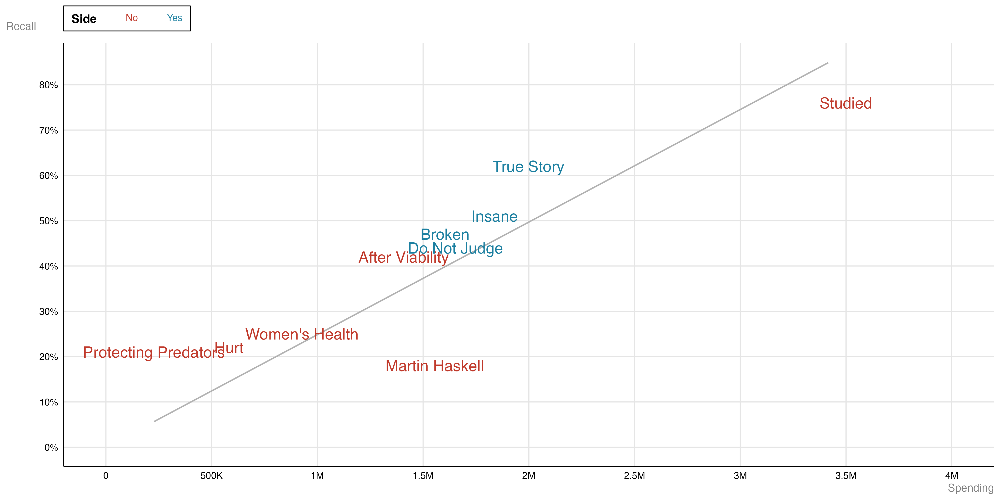
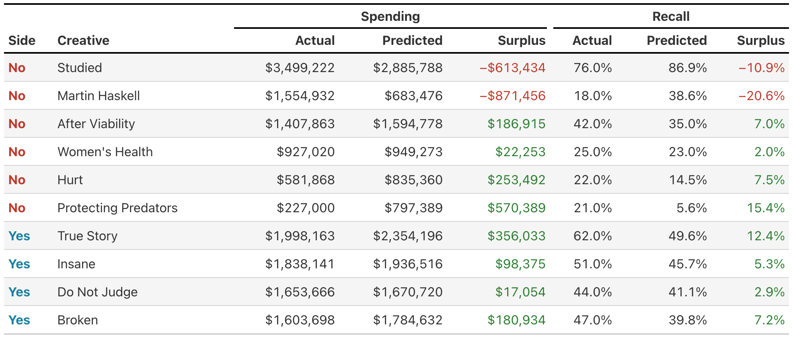
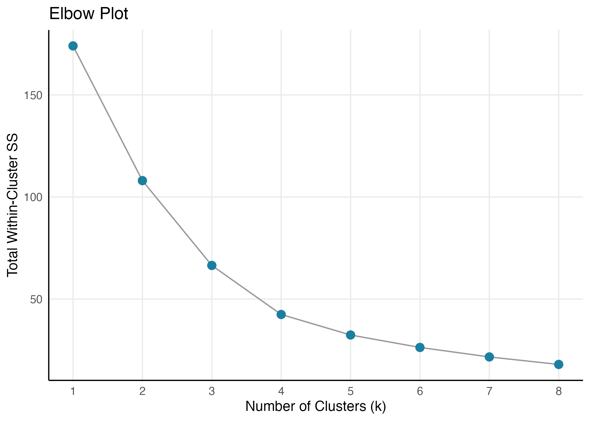
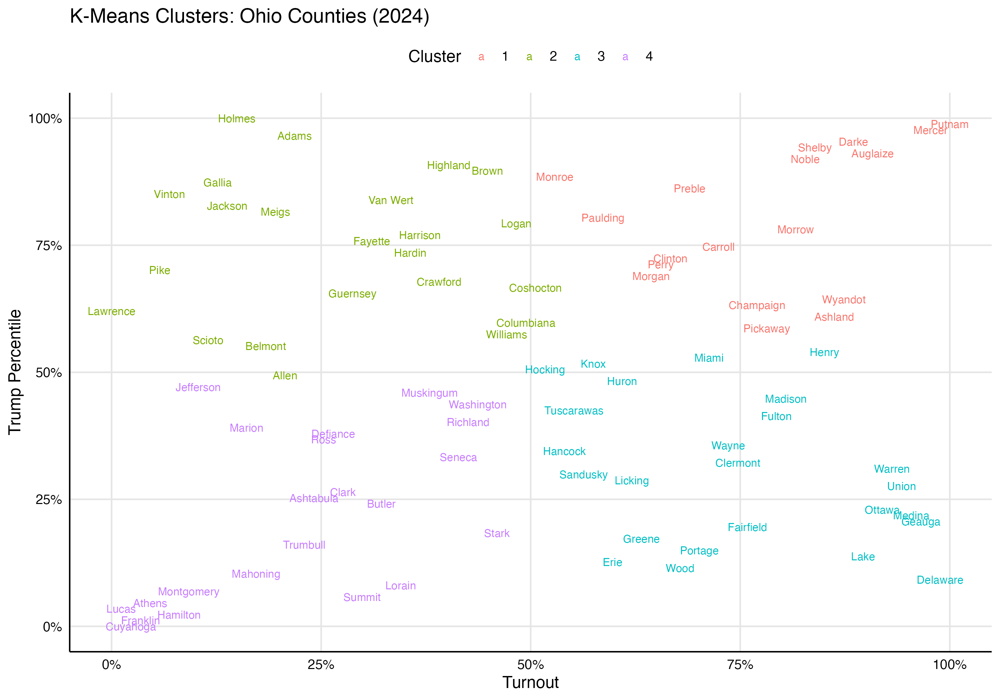
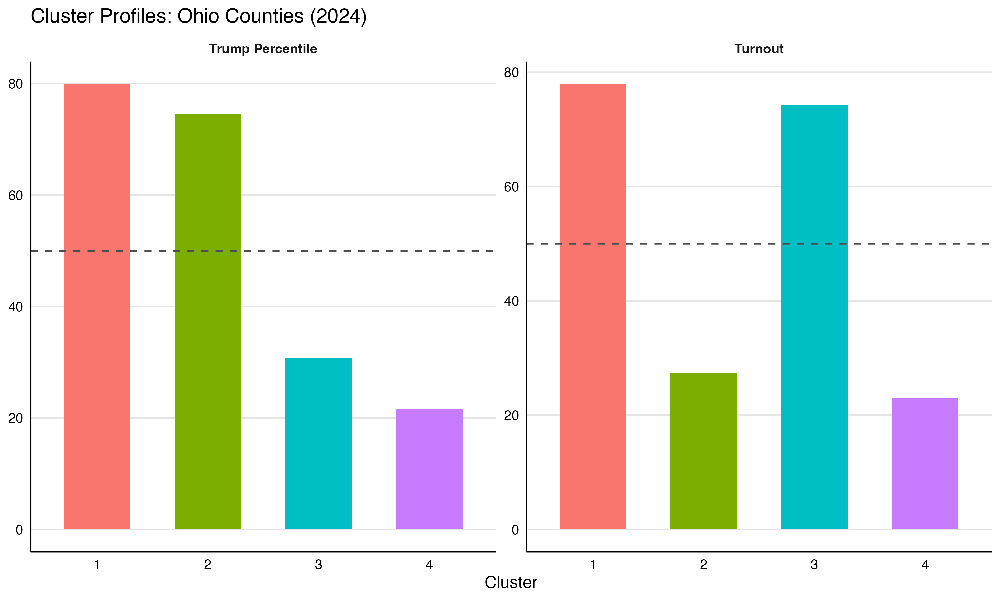
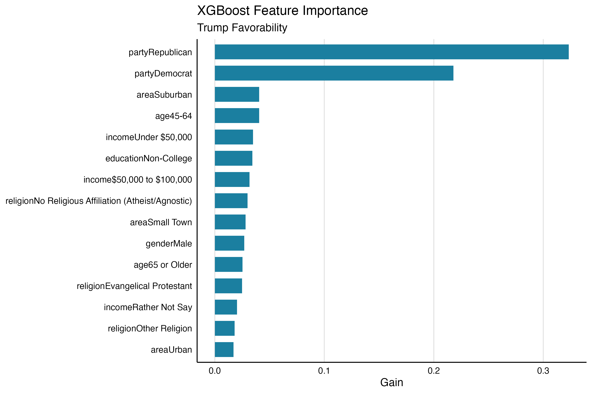
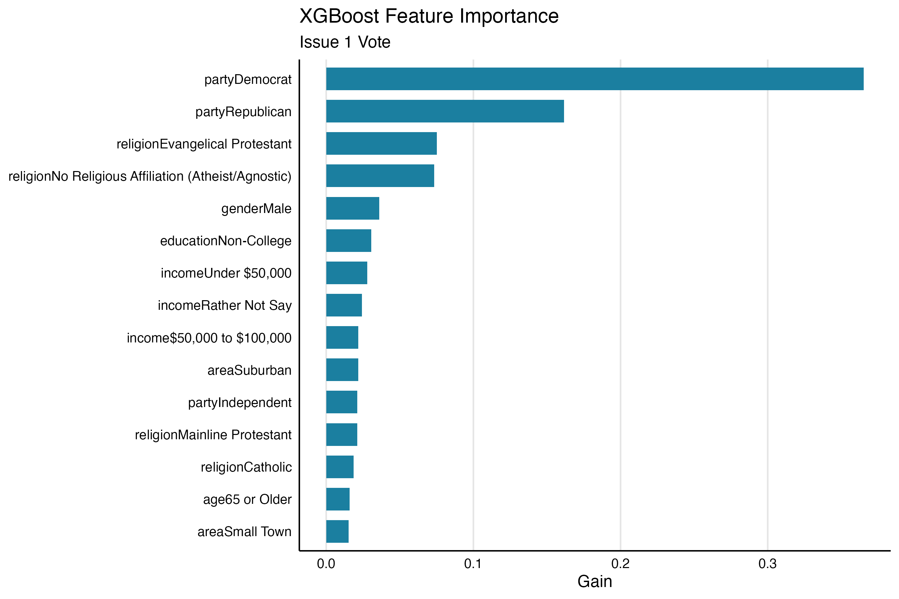

# Intro to Statistical Modeling for Campaigns
### Using Statistics and Data Science Techniques to Answer Campaign Questions

---

## What Are We Doing Today?

Today we're going to use statistical modeling to answer different polical campaign questions. These questions are as follows:

1.) After the 2023 General Election, an advocacy group we worked with wants to do a post-mortem on a handful of ads from the campaign. Their main question is, given that we know how much spend went into each ad buy, how much more or less memorable was the ad than expected?

2.) How do we identify counties in Ohio that behave similarly with regards to 2024 General Election Results? 

3.) A client wants build audiences arround Trump approval rating and Issue 1 vote results. How do we do this?

While these are all specific questions, the techniques we'll go over are broadly applicable to a range of stats and data science problems.

---

## Part 1: Linear Regression

### The Data
We're working with ad spending and voter recall data from the Issue 1 campaign — 10 TV ads, split between YES and NO sides. For each ad we know how much was spent and what percentage of voters remembered seeing it.

| Creative | Side | Spending | Recall |
|---|---|---|---|
| Protecting Predators | NO | $227,000 | 21% |
| Women's Health | NO | $927,020 | 25% |
| Hurt | NO | $581,868 | 22% |
| True Story | YES | $1,998,163 | 62% |
| Broken | YES | $1,603,698 | 47% |
| … | … | … | … |

> **The core question:** Is there a relationship between how much an ad spends and how well voters remember it?



Looking at the chart, there's a pretty clear pattern — higher spending generally means higher recall. But notice that some ads punch above their weight (sitting above the trend line) and some underperform (below it).

### What Linear Regression Does
Linear regression draws the "best fit" line through the data. It minimizes the total distance between every point and the line — finding the single straight line that best describes the relationship.

We actually ran **two separate regressions**:

- **Spend → Recall:** Given how much an ad spent, how much recall should we expect?
- **Recall → Spend:** Given how well an ad was recalled, how much did it likely cost?

Both models were run **without an intercept** — meaning the line is forced through the origin. If you spend nothing, you get zero recall. That's a deliberate assumption.

**The formulas:**
```
Spending = β1 × Recall
Recall   = β2 × Spending
```
No intercept in either — both lines are anchored at (0, 0).

**The actual coefficients:**

| | Coefficient | R² |
|---|---|---|
| **β1** (Recall → Spend) | 3,797,090 | 0.94 |
| **β2** (Spend → Recall) | 0.0000002484 | 0.94 |

**What do those numbers actually mean?**

- **β1 = 3,797,090** — For every additional percentage point of recall, the model expects an ad to have spent roughly **$38,000 more**. An ad with 50% recall should cost around $1.9M by this model's logic.
- **β2 = 0.0000002484** — For every additional $100,000 in spending, the model expects about **2.5 more percentage points of recall**. Spend $1M, expect roughly 25 points of recall.
- **R² = 0.94** — The model explains 94% of the variation in the data. That's a very strong fit for a single-variable model with no intercept, meaning spend and recall are tightly linked across these 10 ads.

### Reading the Results



The **Surplus** columns are where it gets interesting:

- **Spend Surplus** = Actual Spending − Predicted Spending. A positive number means the ad spent *more* than you'd expect given its recall. A negative means it was efficient — it got strong recall without needing as much spend.
- **Recall Surplus** = Actual Recall − Predicted Recall. Positive means the ad outperformed what the model expected. Negative means it underdelivered.

> **The big takeaway:** Linear regression gives us a baseline expectation. Every data point's story is really about how far it sits from that line.

---

## Part 2: K-Means Clustering

### The Data
Now we're looking at all 88 Ohio counties from the 2024 election. For each county we have:
- **Trump percentile** — where the county ranks among all 88 counties for Trump vote share
- **Turnout percentile** — where the county ranks among all 88 counties for voter participation

| County | Turnout | Harris Votes | Trump Votes |
|---|---|---|---|
| Adams | 70.9% | 2,098 | 10,269 |
| Allen | 70.8% | 12,754 | 33,201 |
| Ashland | 77.8% | 6,544 | 19,863 |
| Ashtabula | 71.5% | 15,345 | 27,656 |
| Athens | 68.0% | 14,134 | 11,369 |
| … | … | … | … |

> **The core question:** Do Ohio counties naturally group into distinct types?

### What K-Means Does
K-Means looks at all the counties at once and tries to find natural groupings. You tell it how many groups (called *k*) to find, and it figures out which counties belong together by minimizing the distance between each county and the center of its group.

**How do we pick k?** We use an elbow plot:



Each point shows how "tight" the clusters are for a given k. We're looking for where adding more clusters stops giving us much benefit — the elbow in the curve. Here, **k = 4** is a reasonable choice.

### The Clusters



The scatter plot shows each county labeled and colored by its assigned cluster. Counties close together behave similarly on both turnout and Trump percentile.



The profile chart shows what makes each cluster different. The dashed line is the statewide average — clusters above it are above average on that metric, below it means below average.

### What Are the Four Clusters?

| Cluster | Counties | Avg Trump Percentile | Avg Turnout Percentile | Profile |
|---|---|---|---|---|
| 1 | 18 | ~80th | ~78th | High-Engagement Republican Base |
| 2 | 23 | ~75th | ~27th | Low-Engagement Republican |
| 3 | 25 | ~31st | ~74th | High-Engagement Democrat Base |
| 4 | 22 | ~22nd | ~23rd | Low-Engagement Democrat |

**Cluster 1 — High-Engagement Republican Base** *(Auglaize, Darke, Mercer, Putnam, Shelby, Wyandot…)*
The highest Trump percentiles in the state combined with above-average turnout. These rural counties show up and vote reliably Republican — the backbone of statewide Republican margins.

**Cluster 2 — Low-Engagement Republican** *(Adams, Gallia, Holmes, Jackson, Meigs, Pike, Scioto, Vinton…)*
Strong Republican lean but well below average turnout. These counties are nearly as red as Cluster 1 but leave votes on the table — the clearest mobilization opportunity for a Republican campaign.

**Cluster 3 — High-Engagement Democrat Base** *(Clermont, Delaware, Geauga, Greene, Lake, Licking, Medina, Miami, Portage, Warren…)*
Low Trump support combined with high turnout — in the bottom third of the statewide Trump distribution but well above average on participation. These are the suburban counties where Democrats are most competitive and where turnout already isn't the problem.

**Cluster 4 — Low-Engagement Democrat** *(Athens, Cuyahoga, Franklin, Hamilton, Lucas, Mahoning, Montgomery, Stark, Summit, Trumbull…)*
The lowest Trump percentiles in the state paired with below-average turnout. Ohio's urban cores and Rust Belt cities anchor this cluster. The turnout gap here represents the largest upside for a Democratic mobilization effort.

> **The big takeaway:** Not all Ohio counties are the same, even within the same party lean. Clustering reveals those natural fault lines without us having to manually define them.

---

## Part 3: XGBoost

### The Data
We're using a post-election survey of ~925 Ohio voters. Each respondent answered questions about their Trump favorability, how they voted on Issue 1, and basic demographics.

| Trump Image | Issue 1 Vote | Party | Gender | Age | Education |
|---|---|---|---|---|---|
| Favorable | Voted No | Republican | Male | 65+ | College+ |
| Favorable | Voted No | Independent | Male | 45-64 | Non-College |
| Favorable | Voted No | No Party | Female | 45-64 | Non-College |
| Unfavorable | Voted Yes | Democrat | Female | 65+ | College+ |
| Unfavorable | Voted Yes | Democrat | Female | 65+ | Non-College |
| … | … | … | … | … | … |

**Full input features used in both models:**

| Feature | Values |
|---|---|
| Party | Republican, Democrat, Independent, Other, No Party, Unsure |
| Gender | Male, Female, Other/Non-Binary |
| Age | 18-44, 45-64, 65 or Older |
| Education | College+, Non-College |
| Income | Under $50k, $50k–$100k, $100k+, Rather Not Say |
| Religion | Evangelical Protestant, Catholic, Mainline Protestant, Jewish, Buddhist, Other, None, Rather Not Say |
| Area | Urban, Suburban, Small Town, Rural |
| Ethnicity | White, Non-White |

> **The core question:** Which demographics best predict Trump favorability — and which best predict how someone voted on Issue 1?

### What XGBoost Does
XGBoost is a more powerful model than linear regression. Instead of drawing one straight line, it builds a series of decision trees — each one learning from the mistakes of the last. The final prediction is a combination of all those trees working together.

Think of it like this: the first tree makes a rough guess. The second tree tries to fix what the first got wrong. The third fixes what the second missed. After 100 rounds of this, you have a pretty sharp model.

We ran it as a **binary classifier** — predicting one of two outcomes:
- Trump: *Favorable* or *Unfavorable*
- Issue 1: *Voted Yes* or *Voted No*

Both models use the exact same 8 demographic inputs.

### Feature Importance: Trump Favorability



**Gain** measures how much each feature actually helped the model make correct predictions. Higher gain = more useful. Party affiliation dominates here, which isn't surprising — but look at what comes next.

### Feature Importance: Issue 1 Vote



The Issue 1 model tells a different story. The ranking of features shifts — some demographics that strongly predict Trump favorability are less predictive of how someone voted on Issue 1, and vice versa. That gap is the interesting finding.

### How Well Did the Models Do?

We held back 20% of respondents the model never saw during training, then checked its predictions against their real answers.

#### Trump Favorability

| | Predicted Unfavorable | Predicted Favorable |
|---|---|---|
| **Actually Unfavorable** | ✅ 91 correct | ❌ 19 wrong |
| **Actually Favorable** | ❌ 14 wrong | ✅ 42 correct |

| Metric | Score | Plain English |
|---|---|---|
| **Overall Accuracy** | **80%** | Got 4 out of 5 respondents right |
| **Catch Rate (Favorable)** | 69% | When someone was actually favorable, we correctly called it 69% of the time |
| **Catch Rate (Unfavorable)** | 87% | When someone was actually unfavorable, we correctly called it 87% of the time |
| **Kappa** | 0.56 | Moderate agreement — meaningfully better than random guessing |

The model is stronger at identifying unfavorable respondents than favorable ones — unfavorable is the larger and more consistent group, so it's easier to learn.

#### Issue 1 Vote (Yes vs No)

| | Predicted Voted No | Predicted Voted Yes |
|---|---|---|
| **Actually Voted No** | ✅ 51 correct | ❌ 17 wrong |
| **Actually Voted Yes** | ❌ 15 wrong | ✅ 86 correct |

| Metric | Score | Plain English |
|---|---|---|
| **Overall Accuracy** | **81%** | Got 4 out of 5 respondents right |
| **Catch Rate (Voted Yes)** | 84% | When someone voted Yes, we correctly called it 84% of the time |
| **Catch Rate (Voted No)** | 77% | When someone voted No, we correctly called it 77% of the time |
| **Kappa** | 0.61 | Moderate-to-good agreement — stronger signal than the Trump model |

This model is more balanced across both outcomes and has a slightly higher Kappa, suggesting demographics are a somewhat more consistent predictor of Issue 1 behavior than Trump favorability.

### Predicted Scores

Once trained, the models are applied back to the full survey dataset to assign a score to every respondent — not just the held-out test set.

| Trump Image | Issue 1 Vote | Party | Gender | Age | Trump Fav Score | Issue 1 Score |
|---|---|---|---|---|---|---|
| Favorable | Voted No | Republican | Male | 65 or Older | 0.85 | 0.18 |
| Favorable | Voted No | Independent | Male | 45-64 | 0.76 | 0.26 |
| Favorable | Voted No | No Party | Female | 45-64 | 0.58 | 0.37 |
| Unfavorable | Voted Yes | Democrat | Female | 65 or Older | 0.09 | 0.89 |
| Unfavorable | Voted Yes | Democrat | Female | 65 or Older | 0.11 | 0.86 |
| … | … | … | … | … | … | … |

**`trump_fav_score`** is the model's estimated probability that a respondent has a *Favorable* view of Trump, given only their demographics. **`issue1_score`** is the estimated probability they *Voted Yes* on Issue 1.

These scores range from 0 to 1 and can be used to build audience segments — for example, targeting people with a high `issue1_score` but a low `trump_fav_score` to find cross-pressured voters who supported Issue 1 but are skeptical of Trump.

> **The big takeaway:** XGBoost tells us not just *whether* demographics predict an outcome, but *which ones* matter most and *how much*. Comparing the two importance charts side by side is where the real insight lives.

---